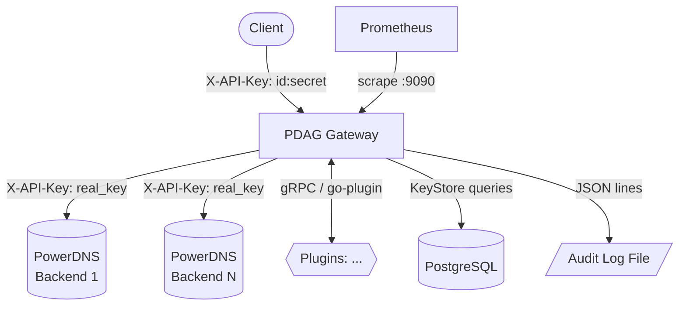
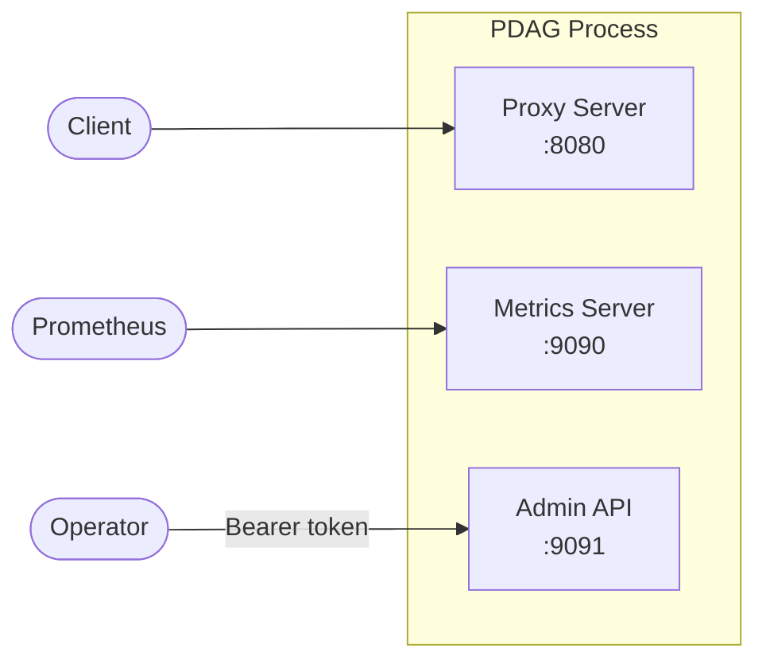
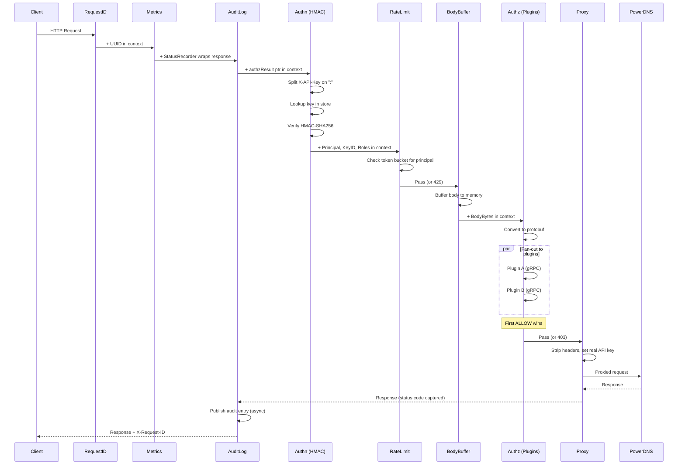
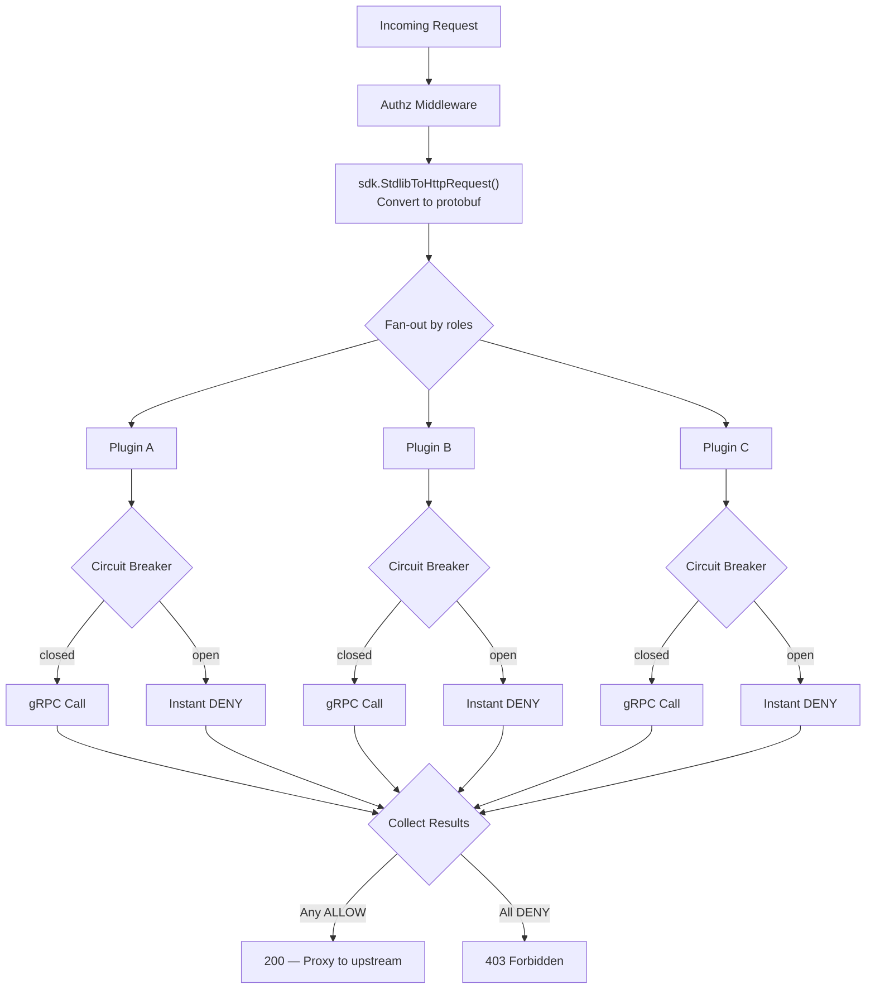

# PDAG Architecture

## System Overview Diagrams

```mermaid
graph TB
    Client([Client])
    PDAG[PDAG Gateway]
    PDNS1[(PowerDNS<br/>Backend 1)]
    PDNS2[(PowerDNS<br/>Backend N)]
    PG[(PostgreSQL)]
    PluginN{{Plugins: ...}}
    AuditFile[/Audit Log File/]
    Prom[Prometheus]

    Client -->|X-API-Key: id:secret| PDAG
    PDAG -->|X-API-Key: real_key| PDNS1
    PDAG -->|X-API-Key: real_key| PDNS2
    PDAG <-->|gRPC / go-plugin| PluginN
    PDAG -->|KeyStore queries| PG
    PDAG -->|JSON lines| AuditFile
    Prom -->|scrape :9090| PDAG
```

### Three Servers

```mermaid
graph LR
    subgraph PDAG Process
        Proxy["Proxy Server<br/>:8080"]
        Metrics["Metrics Server<br/>:9090"]
        Admin["Admin API<br/>:9091"]
    end

    Client([Client]) --> Proxy
    Prometheus([Prometheus]) --> Metrics
    Operator([Operator]) -->|Bearer token| Admin
```

### Request Flow — Middleware Chain

```mermaid
sequenceDiagram
    participant C as Client
    participant RID as RequestID
    participant MET as Metrics
    participant AUD as AuditLog
    participant ATN as Authn (HMAC)
    participant RL as RateLimit
    participant BB as BodyBuffer
    participant ATZ as Authz (Plugins)
    participant PX as Proxy
    participant UP as PowerDNS

    C->>RID: HTTP Request
    RID->>MET: + UUID in context
    MET->>AUD: + StatusRecorder wraps response
    AUD->>ATN: + authzResult ptr in context
    ATN->>ATN: Split X-API-Key on ":"
    ATN->>ATN: Lookup key in store
    ATN->>ATN: Verify HMAC-SHA256
    ATN->>RL: + Principal, KeyID, Roles in context
    RL->>RL: Check token bucket for principal
    RL->>BB: Pass (or 429)
    BB->>BB: Buffer body to memory
    BB->>ATZ: + BodyBytes in context
    ATZ->>ATZ: Convert to protobuf
    par Fan-out to plugins
        ATZ->>ATZ: Plugin A (gRPC)
        ATZ->>ATZ: Plugin B (gRPC)
    end
    Note over ATZ: First ALLOW wins
    ATZ->>PX: Pass (or 403)
    PX->>PX: Strip headers, set real API key
    PX->>UP: Proxied request
    UP-->>PX: Response
    PX-->>AUD: Response (status code captured)
    AUD->>AUD: Publish audit entry (async)
    AUD-->>C: Response + X-Request-ID
```

### Plugin Authorization Flow

```mermaid
graph TD
    REQ[Incoming Request] --> MW[Authz Middleware]
    MW --> CONV["sdk.StdlibToHttpRequest()<br/>Convert to protobuf"]
    CONV --> FANOUT{Fan-out by roles}

    FANOUT --> P1[Plugin A]
    FANOUT --> P2[Plugin B]
    FANOUT --> P3[Plugin C]

    P1 --> CB1{Circuit Breaker}
    P2 --> CB2{Circuit Breaker}
    P3 --> CB3{Circuit Breaker}

    CB1 -->|closed| GRPC1[gRPC Call]
    CB1 -->|open| DENY1[Instant DENY]
    CB2 -->|closed| GRPC2[gRPC Call]
    CB2 -->|open| DENY2[Instant DENY]
    CB3 -->|closed| GRPC3[gRPC Call]
    CB3 -->|open| DENY3[Instant DENY]

    GRPC1 --> RESULT{Collect Results}
    GRPC2 --> RESULT
    GRPC3 --> RESULT
    DENY1 --> RESULT
    DENY2 --> RESULT
    DENY3 --> RESULT

    RESULT -->|Any ALLOW| ALLOW[200 — Proxy to upstream]
    RESULT -->|All DENY| DENY[403 Forbidden]
```